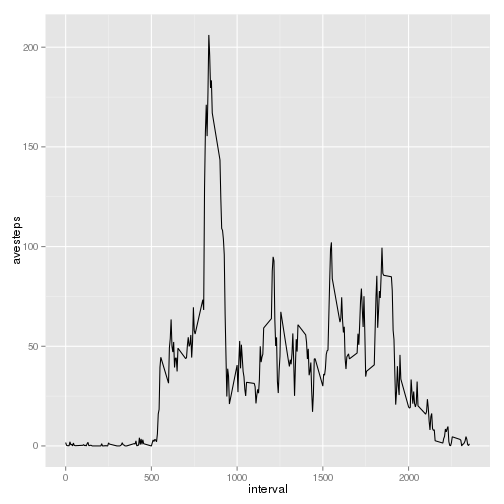
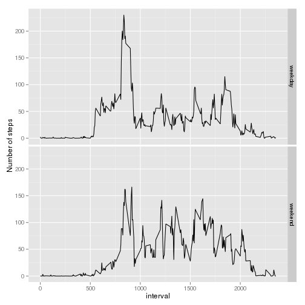

#peer assessment 1
### by Alpha Shen

##Loading and preprocessing the data


```r
setwd("~/Rwork")
data <- read.csv("activity.csv", header = TRUE)
```


##What is mean total number of steps taken per day? NA value can be ignored.  
######For this part of the assignment, you can ignore the missing values in the dataset.  
- Make a histogram of the total number of steps taken each day

    


```r
daysum <- tapply(data$steps, data$date, sum, na.rm = TRUE)
daysum <- as.vector(daysum)
hist(daysum, main = "Hist Graph for total number of steps each day", xlab = "total steps each day")
```

 

- Calculate and report the mean and median total number of steps taken per day
    

```r
# calculate and report the mean 
daymean <- mean(daysum)
daymean
```

```
## [1] 9354.23
```

```r
# calculate and report the median
daymedian <- median(daysum)
daymedian
```

```
## [1] 10395
```

##What is the average daily activity pattern?
 -  Make a time series plot (i.e. type = "l") of the 5-minute interval (x-axis) and the average number of steps 
    taken, averaged across all days (y-axis)
 


```r
library(ggplot2)
ave_interval <- as.data.frame(tapply(data$steps, as.factor(data$interval), mean, na.rm = TRUE))
ave_interval$interval = as.numeric(rownames(ave_interval))
ave_interval$avesteps = ave_interval[,1]
ave_interval <- ave_interval[, c(-1)]

plot1 <- ggplot(ave_interval, aes(interval, avesteps, group = 1))
plot1 + geom_line()
```

 

```r
#alternative plot code
plot(ave_interval$interval, ave_interval$avesteps, type = "l",
    xlab = "Intervals",
    ylab = "Averaged Steps for all day")
```

 

 -  Which 5-minute interval, on average across all the days in the dataset, contains the maximum number of steps?
 
 

```r
#the interval with max number of steps on average all days
ave_interval[ave_interval$avesteps ==max(ave_interval$avesteps),]
```

```
##     interval avesteps
## 835      835 206.1698
```

##Imputing missing values
-   Calculate and report the total number of missing values in the dataset (i.e. the total number of rows with NAs)


```r
#calculate the number of missing values
sum(is.na(data$steps))
```

```
## [1] 2304
```
             
-   Devise a strategy for filling in all of the missing values in the dataset. 
    The strategy does not need to be sophisticated. For example, you could use the mean/median for that 
    day, or the mean for that 5-minute interval, etc.   
-   Create a new dataset that is equal to the original dataset but with the missing data filled in.


```r
# set strategy: considering some of the days missed all data, use mean of interval to set up missing value.
newdata = data

for (i in 1:length(newdata$steps)){
    if (is.na(newdata$steps[i])){
        if((i %% length(ave_interval$avesteps))== 0){   ## otherwise this result a zero to be filled into subsetting
            newdata$steps[i]=ave_interval$avesteps[length(ave_interval$avesteps)] 
        }
        else {
            newdata$steps[i] = ave_interval$avesteps[i %% length(ave_interval$avesteps)]
        }
    }
}
```

-   Make a histogram of the total number of steps taken each day and Calculate and report the mean and median 
    total number of steps taken per day. Do these values differ from the estimates from the first part of 
    the assignment? What is the impact of imputing missing data on the estimates of the total daily number of steps?
    

```r
daysumnew <- tapply(newdata$steps, data$date, sum)
daysumnew <- as.vector(daysumnew)
hist(daysumnew, main = "Hist Graph for total number of steps each day (newdata)", xlab = "total steps each day")
```

 

- Calculate and report the mean and median total number of steps taken per day
    

```r
# calculate and report the mean 
daymeannew <- mean(daysumnew)
daymeannew
```

```
## [1] 10766.19
```

```r
# calculate and report the median
daymediannew <- median(daysumnew)
daymediannew
```

```
## [1] 10766.19
```

```r
####################################################################
# Yes.after inputing the missing value, the mean and median differs from first estimates, 
# median is more closer to mean value. and the hist look more like a normal distribution. 
```

##Are there differences in activity patterns between weekdays and weekends?

#####For this part the weekdays() function may be of some help here. Use the dataset with the filled-in missing values for this part.

-   Create a new factor variable in the dataset with two levels – “weekday” and “weekend” indicating whether a given date is a weekday or weekend day.


```r
library(lubridate)

weekday <- c("Monday", "Tuesday", "Wednesday", "Thursday", "Friday")

## this function cost too much time to calculate
#for (i in 1:length(newdata$steps)){
#    if (any(weekdays(ymd(newdata$date[i])) == weekday)){
#        newdata$week[i] <- "weekday"
#    }
#    else{
#        newdata$week[i] <- "weekend"
#    }
#}

datelevel <- as.data.frame(levels(newdata$date))
datelevel$week <- weekdays(ymd(datelevel[,1]))

## transfer the weekdays into weekday and weekend
for (i in 1:length(datelevel$week)){
    if (any(datelevel$week[i] == weekday)){
        datelevel$weekday[i] <- "weekday"
    }
    else{
        datelevel$weekday[i] <- "weekend"
    }
}
## match the days in newdata with weekday

newdata$week <- datelevel$weekday[match(newdata$date, datelevel[,1])]
```

-   Make a panel plot containing a time series plot (i.e. type = "l") of the 5-minute interval (x-axis) and the average number of steps taken, averaged across all weekday days or weekend days (y-axis). See the README file in the GitHub repository to see an example of what this plot should look like using simulated data.


```r
## calculate the averaged steps across workday and weekend
avgint <- tapply(newdata$steps, list(newdata$interval, newdata$week), mean)

#tidy data
avgint <- as.data.frame(avgint)
avgint$interval <- as.numeric(rownames(avgint))
avgint <- avgint[,c(3,1,2)]
library(reshape2)
avgintmelt <- melt(avgint, measure.vars = c("weekday", "weekend"))

# make the panel plot

plot2 <- ggplot(avgintmelt, aes(interval, value, group = 1))
plot2 + geom_line() + facet_grid(variable ~ .) +
    ylab("Number of steps")
```

 
